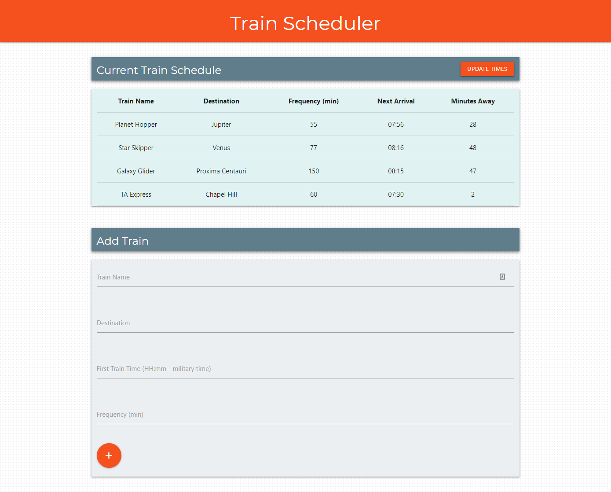

# TrainScheduler
## UNC Coding Bootcamp Homework #7  10-23-2018

This app allows clients on different machines to dynamically create a train schedule that provides information on the next available train and time until its arrival.

The deployed app can be viewed at: https://zinc-glaze.github.io/TrainScheduler/

### Screenshot

The assignment gavethe following requirements:
  * When adding trains, administrators should be able to submit the following:
    * Train Name
    * Destination 
    * First Train Time -- in military time
    * Frequency -- in minutes
  * Code this app to calculate when the next train will arrive; this should be relative to the current time.
  * Users from many different machines must be able to view same train times.
  * Styling and theme are completely up to you. Get Creative!

In addition to the above, the app features:
  * Responsiveness across viewports
  * Basic validation of user time inputs
  * A button to update all train times 

This app uses the following tools:
  * HTML
  * Materialize CSS Framework for layout, responsiveness, and basic styling
  * CSS for additional styling
  * Javascript for app logic, collecting user input, and writing to the DOM
  * jQuery for Javascript library
  * Firebase for data persistence
  * Moment.js for parsing and calculating times

Future development of the app will add:
  * "Update" and "Delete" buttons for each individual train. This would allow the user to update the arrival times or completely remove a specific train from the display and the database.
  * Auto refresh of train arrival times at a specified interval (e.g. 30 seconds).

